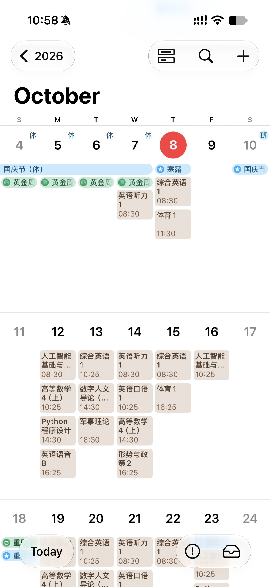
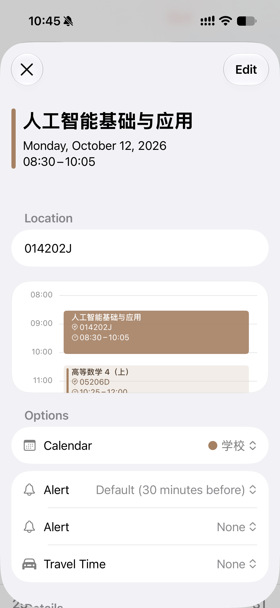
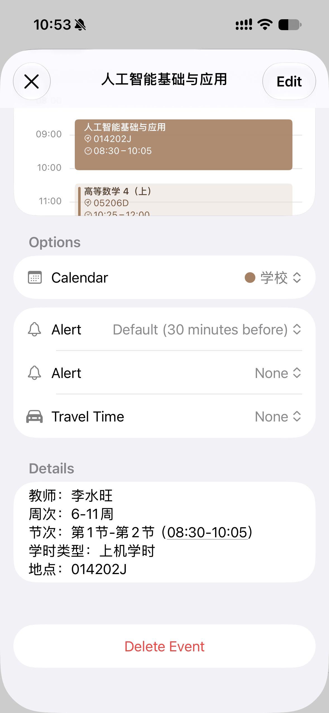
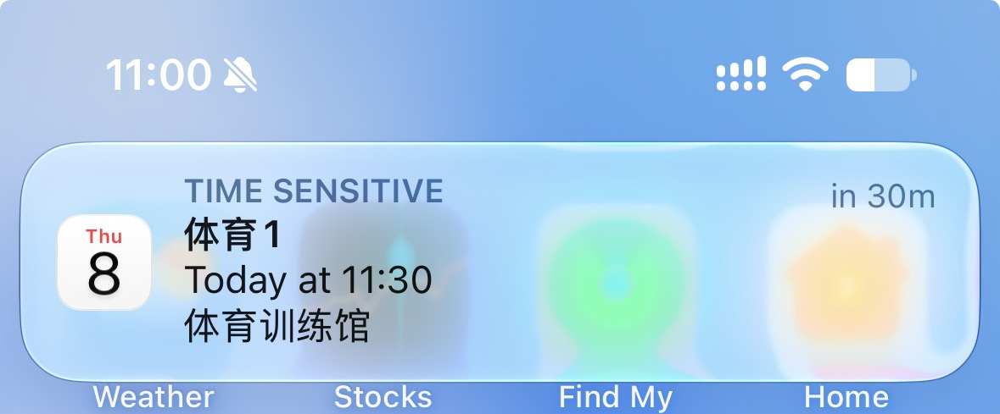
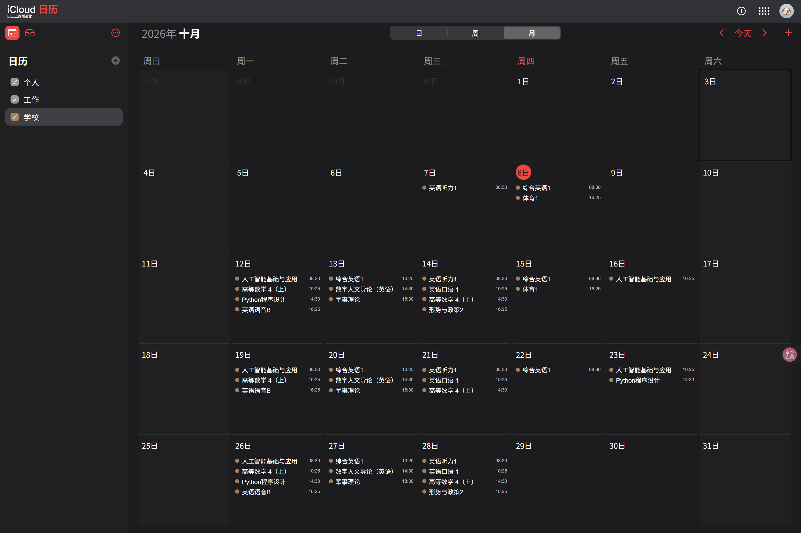

# glut-ics

> 把桂林理工大学教务系统的课表导出为符合 **RFC 5545** 标准的 `.ics` 文件，一键导入 **Google Calendar / Apple Calendar / Outlook / 各类国产日历**。

[](https://www.python.org/)
[](LICENSE)
[](#安装)
[](https://github.com/JennnyK/glut_ics/actions/workflows/ci.yml)
[](tests)

---

## 项目简介

`glut-ics` 是一个**纯 Python 标准库实现、零第三方依赖**的命令行工具，用于把桂林理工大学
教务系统（[jw.glut.edu.cn](https://jw.glut.edu.cn) / 南宁校区）的课表数据，转换为符合
**RFC 5545** 标准的 iCalendar（`.ics`）文件。

生成的文件可直接导入手机与电脑自带日历，课程会以**重复事件**的形式自动展开到整个学期，
并附带教师、教室、周次、节次等完整信息。数据获取方式与字段解析逻辑参考
[hzhkdh/glut-schedule](https://github.com/hzhkdh/glut-schedule)：
登录教务系统 → 请求大节课表接口 → 解析 HTML 网格 → 生成标准日历事件。

支持**在线登录直连抓取**与**离线解析已保存的课表 HTML** 两种模式，即使在启用验证码
或统一身份认证、无法自动登录的场景下，也能正常工作。

---

## 效果展示

导入后，课表会自动出现在系统日历中，支持按周查看与事件提醒：

<table>
  <tr>
    <td align="center" width="25%">
      <br>
      <sub>iPhone 日历 · 月视图</sub>
    </td>
    <td align="center" width="25%">
      <br>
      <sub>事件详情 · 课程信息</sub>
    </td>
    <td align="center" width="25%">
      <br>
      <sub>事件详情 · 时间地点</sub>
    </td>
    <td align="center" width="25%">
      <br>
      <sub>上课提醒</sub>
    </td>
  </tr>
</table>

<p align="center">
  <br>
  <sub>macOS / iCloud 日历 · 学期课表总览</sub>
</p>

---

## 功能特性

- **零依赖**：仅使用 Python 标准库（`urllib` / `http.cookiejar` / `re` / `html` / `datetime`），Python ≥ 3.9 开箱即用。
- **双模式**：支持**登录直连抓取**与**离线解析已保存的课表 HTML**。
- **编码自适应**：自动识别页面编码（教务课表页为 **GBK**，按 UTF-8 硬解会全部乱码）。
- **作息自动匹配**：内置雁山 / 屏风 / 南宁三校区作息时间表，含桂林特有的 **"中午1/中午2" 节次偏移**。
- **重复事件**：支持连续周 / 单双周 / 多段不规则周次，自动拆分为合规的 `RRULE`。
- **完整时区**：所有事件使用 `TZID=Asia/Shanghai` 并内嵌 `VTIMEZONE`，跨时区导入不偏移。
- **导入校验**：内置校验器检查结构配对、必需属性、时间格式、UID 唯一性、RRULE 合法性。
- **可编程**：提供清晰的 Python API，可嵌入到自己的脚本中。

---

## 安装

### 环境要求

- **Python ≥ 3.9**（已在 3.9 – 3.13 上测试）
- **无第三方运行时依赖**

### 方式一：从源码安装（推荐）

```bash
git clone https://github.com/JennnyK/glut_ics.git
cd glut_ics
pip install -e .
```

安装完成后即可在**任意目录**使用 `glut-ics` 命令。

### 方式二：直接运行（不安装）

```bash
git clone https://github.com/JennnyK/glut_ics.git
cd glut_ics
python -m glut_ics --help
```

> **运行目录很重要**：`python -m glut_ics` 必须在**项目根目录**（同时包含 `glut_ics/`、`tests/` 的那一层）执行。
> 若你在 `...\课表\glut_ics` 目录里运行，会报 `No module named glut_ics` —— 因为 Python 只在当前目录里
> 寻找名为 `glut_ics` 的子目录，而它自己就是 `glut_ics`。

---

## 使用方法

### 1. 在线模式（登录直连抓取）

```bash
# 密码可通过环境变量提供，避免写入命令历史
export GLUT_PASSWORD='你的密码'          # Windows PowerShell: $env:GLUT_PASSWORD='你的密码'
python -m glut_ics --username 你的学号 --campus guilin --output schedule.ics

# 其他学期
python -m glut_ics --username 你的学号 --year 2026 --season autumn

# 交互式输入密码（不传 --password，也不设环境变量时）
python -m glut_ics --username 你的学号
```

### 2. 离线模式（解析已保存的课表页面）

从浏览器登录教务系统、打开课表页并"另存为" HTML，然后：

```bash
python -m glut_ics --html timetable.html \
  --semester-start 2026-03-09 \
  --profile yanshan \
  --output schedule.ics
```

> 离线模式必须提供 `--semester-start`（第 1 周周一），因为 ICS 需要把"第 N 周"落到具体日期。

### 3. 校验已生成的日历

```bash
python -m glut_ics --validate-only --output schedule.ics
```

### 命令行参数

| 参数 | 说明 |
|---|---|
| `--username, -u` | 教务系统学号 |
| `--password, -p` | 密码（优先级：参数 > 环境变量 `GLUT_PASSWORD` > 交互输入） |
| `--campus` | `guilin`（默认）/ `nanning` |
| `--year` | 门户年份，如 `2026`（缺省时从门户页面推断） |
| `--season` | `spring` / `autumn`（缺省时从门户页面推断） |
| `--student-id` | 内部学号，跳过自动解析 |
| `--semester-start` | 第 1 周周一，`YYYY-MM-DD` |
| `--max-week` | 学期总周数（缺省自动推断：学期起止日期 → 周次落地页 → 课表反推 → 20） |
| `--profile` | 作息档案：`yanshan`(默认) / `pingfeng` / `nanning` |
| `--calendar-name` | 日历名称（写入 `X-WR-CALNAME`） |
| `--html` | 离线模式：读取已保存的课表 HTML |
| `--output, -o` | 输出文件，默认 `schedule.ics` |
| `--stdout` | 输出到标准输出 |
| `--expand` | 把每一次课写成独立事件（不用 `RRULE`），兼容不展开重复规则的日历程序 |
| `--validate-only` | 只校验已有 `.ics` |

---

## 作息时间表

**默认使用内置档案，与校区对应**：桂林默认 `yanshan`（雁山），南宁默认 `nanning`。

```bash
python -m glut_ics --username 学号                      # 雁山（桂林默认）
python -m glut_ics --username 学号 --profile pingfeng    # 屏风
```

> ⚠️ **为什么必须手动指定校区作息？**
>
> 学校教务处明确说明：*"由于两校区上课时间不一样，教务管理信息系统上的课表**只能显示一个校区（屏风校区）上课时间**"*。
>
> 也就是说，**抓到的课表页面上的时间恒为屏风作息，不能用来判断你实际在哪个校区**。
> 所以工具不会从页面推断作息，而是按你指定的（或桂林默认的雁山）生成；
> 若你使用雁山作息而页面显示屏风时间，会打印一条提示提醒你确认。

| 节次 | 屏风校区 | 雁山校区 |
|---|---|---|
| 第1节 | 08:20–09:05 | 08:30–09:15 |
| 第2节 | 09:15–10:00 | 09:20–10:05 |
| 第3节 | 10:20–11:05 | 10:25–11:10 |
| 第4节 | 11:15–12:00 | 11:15–12:00 |
| 第5节 | 14:30–15:15 | 14:30–15:15 |
| 第6节 | 15:25–16:10 | 15:20–16:05 |
| 第7节 | 16:20–17:05 | 16:25–17:10 |
| 第8节 | 17:15–18:00 | 17:15–18:00 |
| 第9节 | 18:30–19:15 | 18:30–19:15 |
| 第10节 | 19:25–20:10 | 19:20–20:05 |
| 第11节 | 20:20–21:05 | 20:15–21:00 |
| 第12节 | 21:15–22:00 | 21:05–21:50 |

内置档案数值取自参考仓库（其中雁山为 2026 春起的新作息）：

| 档案 | 校区 | 说明 |
|---|---|---|
| `yanshan` | 桂林雁山 | 默认；第 1 节 08:30-09:15 |
| `pingfeng` | 桂林屏风 | 第 1 节 08:20-09:05 |
| `nanning` | 南宁 | 无中午时段，第 1-11 节直排 |

**中午偏移**：桂林在两处时段之间夹了"中午1/中午2"。教务节次与内部节次对应关系：

```
教务节次   1 2 3 4   中午1 中午2   5 6 7 ... 12
内部节次   1 2 3 4      5     6     7 8 9 ... 14
```

解析器统一按"内部节次"存储，因此 `第5节` 在桂林会自动落到 `14:30`。
南宁没有中午时段，节次直排 `1-11`。

---

## 时区与重复事件

- **时区**：所有事件使用 `DTSTART;TZID=Asia/Shanghai`，并内嵌 `VTIMEZONE`
  （UTC+8，无夏令时），跨时区导入不会发生偏移。
- **重复规则**：一个 `VEVENT` 只允许一个 `RRULE`（RFC 5545），因此周次会先被拆成"等差数列"：

  | 周次文本 | 展开周次 | 生成的规则 |
  |---|---|---|
  | `1-12周` | 1..12 | `FREQ=WEEKLY;BYDAY=MO;COUNT=12` |
  | `1-16周单周` | 1,3,…,15 | `FREQ=WEEKLY;INTERVAL=2;BYDAY=WE;COUNT=8` |
  | `3-12,16-17` | 3..12, 16,17 | 两条事件：`COUNT=10` 与 `COUNT=2` |
  | `第14周` | 14 | `COUNT=1` |

- **行折叠**：任意内容行超过 75 个八位组时按 §3.1 折叠，续行以单个空格开头，且不会劈开多字节 UTF-8 字符。

> **为什么在文件里搜不到某一天？**
>
> 因为用的是**重复规则**。例如体育1 在文件里只有一条事件块，写的是
> "从 10-08 起、每 7 天、共 2 次"，并**不会**逐天列出 10-08、10-15 两条。
> 如果日历程序不展开 `RRULE`，就只会显示第一天，看起来像"后面的课少了很多"。
>
> 遇到这种情况请加 `--expand`，改为每次课一条独立事件（桂林一个学期约 160+ 条）：
>
> ```bash
> python -m glut_ics --username 学号 --expand -o schedule.ics
> ```
>
> 两种方式生成的内容完全等价，只是"一条重复规则" vs "逐条列出"的区别。

---

## 编程接口

```python
from glut_ics import AcademicClient, GlutScheduleParser, SemesterInfo, build_ics, validate_ics

client = AcademicClient(campus="guilin")
client.login(username, password)
session = client.fetch_semester()               # 自动推断学期 / 学号 / 起止日期 / 总周数

parser = GlutScheduleParser()
courses = parser.parse_personal_schedule(session.timetable_html)

semester = SemesterInfo(
    campus="guilin", year=2026, season="spring",
    year_id="46", term_id="1",
    start_monday=session.start_monday, max_week=20, display_name="2026·春",
)
result = build_ics(courses, semester, profile="yanshan")
assert not validate_ics(result.text)            # 导入校验
open("schedule.ics", "w", encoding="utf-8", newline="").write(result.text)
```

---

## 目录结构

```
glut_ics/
├── glut_ics/                  # 核心包（纯标准库）
│   ├── __init__.py            # 对外导出的公开 API
│   ├── __main__.py            # 支持 python -m glut_ics
│   ├── academic.py            # 教务登录与课表抓取（对应参考仓库 service/academic/*）
│   ├── parser.py              # 课表 HTML 解析（对应 service/parser/AcademicScheduleParser.kt）
│   ├── periods.py             # 三校区作息时间表（对应 data/model/ScheduleModels.kt）
│   ├── weektext.py            # 周次文本解析（对应 data/model/WeekText.kt）
│   ├── sections.py            # 节次解析与中午偏移（对应 sections/offsetSectionForNoon）
│   ├── ics.py                 # ICS 生成与导入校验
│   ├── models.py              # 数据模型
│   ├── cli.py                 # 命令行入口
│   └── py.typed               # 类型标注标记（PEP 561）
├── tests/                     # 单元测试（含参考仓库真实南宁课表样本）
│   ├── fixtures/              # HTML 测试样本
│   └── test_*.py              # 72 项测试
├── examples/                  # 生成的示例 .ics
│   ├── guilin_schedule.ics
│   └── nanning_schedule.ics
├── docs/
│   ├── images/                # README 效果图
│   └── plans/                 # 设计文档
├── .github/workflows/ci.yml   # GitHub Actions 持续集成
├── pyproject.toml             # 打包与项目元数据
├── requirements.txt           # 运行时依赖说明（零依赖）
├── requirements-dev.txt       # 开发/测试可选依赖
├── CHANGELOG.md               # 更新日志
├── CONTRIBUTING.md            # 贡献指南
├── LICENSE                    # MIT
└── README.md
```

---

## 测试

```bash
python -m unittest discover -s tests -t . -v
```

测试覆盖：真实南宁课表样本解析、桂林中午偏移、单双周、畸形周次（`2-1` 不会被当作周次）、
多段周次的 RRULE 拆分、行折叠字节数、转义、导入校验、命令行端到端，共 **72 项**。

---

## 与参考仓库的对应关系

| 本工具 | 参考仓库 |
|---|---|
| `academic.AcademicClient.login` | `AcademicLoginHttpClient` / `AcademicLoginService` |
| `academic.AcademicClient.login_via_oa` | `AcademicOALoginClient` |
| `academic.AcademicClient.fetch_semester` | `AcademicSemesterImportService.importSemester` |
| `parser.GlutScheduleParser` | `service/parser/AcademicScheduleParser.kt` |
| `periods.*` | `data/model/ScheduleModels.kt` 中的作息表函数 |
| `weektext.*` | `data/model/ScheduleModels.kt` / `WeekText.kt` |
| `sections.*` | `offsetSectionForNoon` / `parseDisplaySectionRange` |

课表数据源为 `GET /academic/manager/coursearrange/showTimetable.do`
（参数 `id / yearid / termid / timetableType=STUDENT / sectionType=BASE`），
单元格形如 `<<课程名>>;序号 ← 教室 ← 教师 ← 周次 ← 学时类型`。

---

## 注意事项

- 教务系统若启用验证码 / 统一身份认证，自动登录可能失败，请改用 `--html` 离线模式。
- 本工具仅用于导出本人在校课表，请勿用于其他用途；账号密码只在内存中使用，不会写入磁盘。
- 生成的 `.ics` 已在本仓库的 `.gitignore` 中忽略，**请勿将包含真实课表的文件提交到公开仓库**。

---

## 贡献

欢迎提交 Issue 与 Pull Request！请先阅读 [CONTRIBUTING.md](CONTRIBUTING.md)。

## 许可证

本项目基于 [MIT License](LICENSE) 开源。

## 致谢

- 数据获取与解析逻辑参考 [hzhkdh/glut-schedule](https://github.com/hzhkdh/glut-schedule)。
- 感谢桂林理工大学教务系统提供的课表接口。
